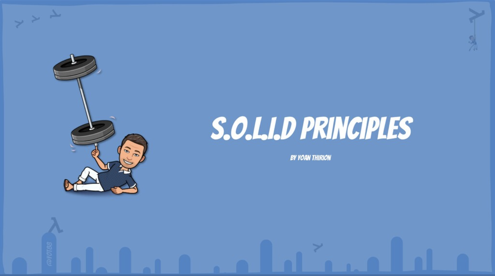

# SOLID design principles

This repository contains examples that violate the SOLID principles:

- Single Responsibility Principle: Every class should have a single responsibility. A class should have one, and only
 one, reason to change. 

- Open/Closed Principle: You should be able to extend a classes behavior, without modifying it. Software entities 
should be open for extension, but closed for modification.

- Liskov Substitution Principle: Derived classes must be substitutable for their base classes. Functions that use references to base classes must be able to use objects of derived classes without knowing it.

- Interface Segregation Principle: Make fine grained interfaces that are client specific. Clients should not be 
forced to depend on interfaces they do not use.

- Dependency Inversion Principle: Depend on abstractions, not on concretions. High-level modules should not depend on
 low-level modules. Both should depend on abstractions.

 Abstractions should not depend on details. Details should 
 depend on abstractions.

The objective is modify each of the examples in order to not violate the corresponding SOLID principle.

## Plan
Explanations and exercises to run the kata available [here](https://yoan-thirion.gitbook.io/knowledge-base/software-craftsmanship/code-katas/write-s.o.l.i.d-code)

## Solution
Solutions explanations are available [here](/solution.md)
